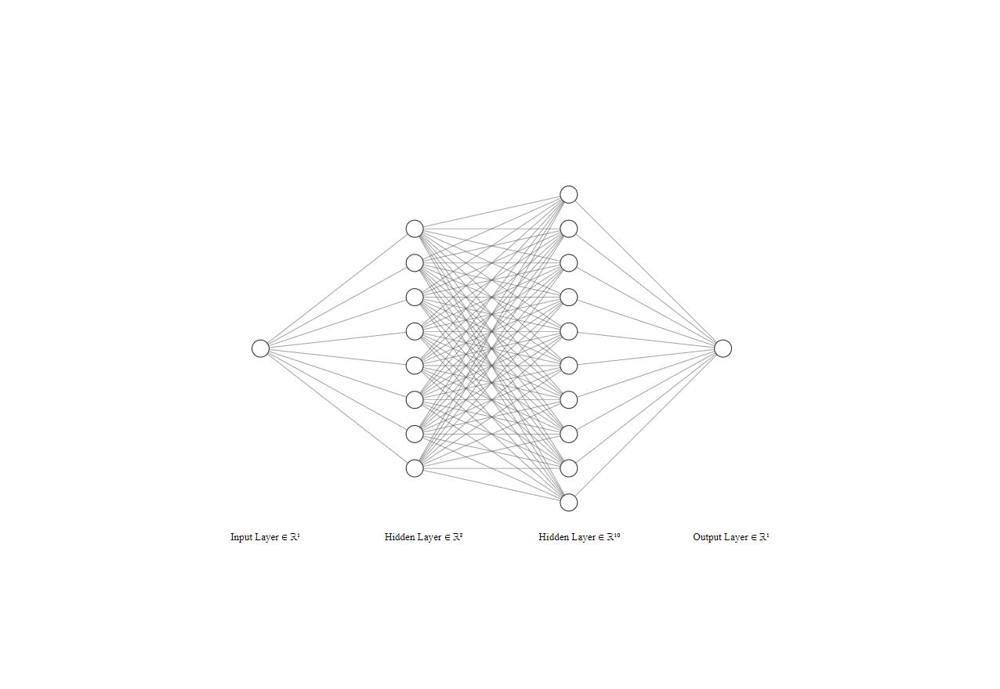
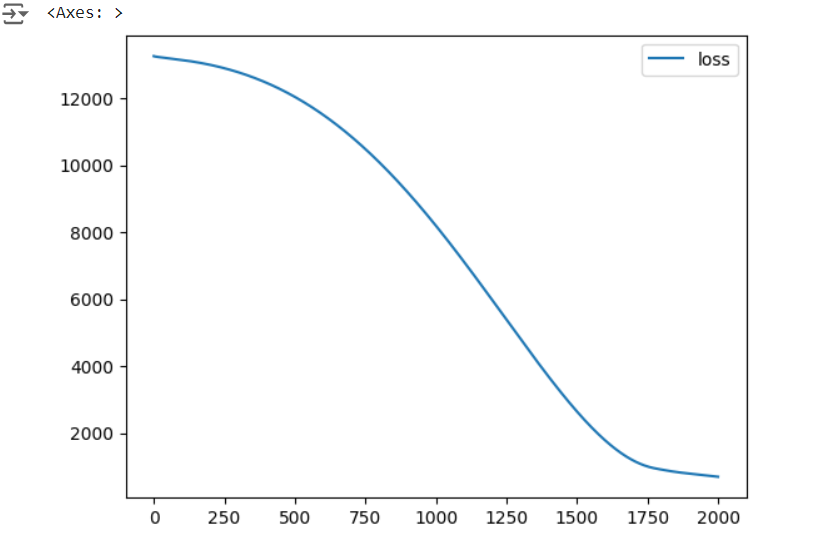
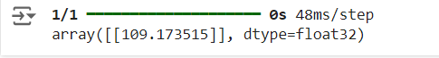

# Developing a Neural Network Regression Model

## AIM

To develop a neural network regression model for the given dataset.

## THEORY

Developing a neural network regression model entails a structured process, encompassing phases such as data acquisition, preprocessing, feature selection, model architecture determination, training, hyperparameter optimization, performance evaluation, and deployment, followed by ongoing monitoring for refinement.

## Neural Network Model



## DESIGN STEPS

### STEP 1:

Loading the dataset

### STEP 2:

Split the dataset into training and testing

### STEP 3:

Create MinMaxScalar objects ,fit the model and transform the data.

### STEP 4:

Build the Neural Network Model and compile the model.

### STEP 5:

Train the model with the training data.

### STEP 6:

Plot the performance plot

### STEP 7:

Evaluate the model with the testing data.

## PROGRAM
### Name: SELVAMUTHU KUMARAN V
### Register Number: 212222040151
```python

from google.colab import auth
import gspread
from sklearn.model_selection import train_test_split
from sklearn.preprocessing import MinMaxScaler
from tensorflow.keras.models import Sequential
from tensorflow.keras.layers import Dense
from sklearn.preprocessing import StandardScaler
from oauth2client.client import GoogleCredentials
from google.auth import default
import pandas as pd
data=pd.read_csv("/content/dataset - Sheet1.csv")
data
auth.authenticate_user()
creds,_=default()
gc=gspread.authorize(creds)

worksheet=gc.open('dataset').sheet1
data=worksheet.get_all_values()

dataset1 = pd.DataFrame(data[1:], columns=[col.strip() for col in data[0]])

dataset1 = dataset1.astype({'INPUT':'float'})
dataset1 = dataset1.astype({'OUTPUT':'float'})
dataset1.head()
X = dataset1.iloc[:, :-1].values
y = dataset1.iloc[:, -1].values
X_train, X_test, y_train, y_test = train_test_split(X, y, test_size = 0.2, random_state = 0)
Scaler=MinMaxScaler()
Scaler.fit(X_train)
X_train=Scaler.transform(X_train)
ai_brain=Sequential([
    Dense(8,activation='relu'),

    Dense(10,activation='relu'),
    Dense(1)
])
ai_brain.compile(optimizer='rmsprop',loss='mse')
ai_brain.fit(X_train,y_train,epochs=2000)
loss_df = pd.DataFrame(ai_brain.history.history)
loss_df.plot()
x_test1=Scaler.transform(X_test)
ai_brain.evaluate(x_test1,y_test)
X_n1 = [[10]]
X_n1_1 = Scaler.transform(X_n1)
ai_brain.predict(X_n1_1)

```
## Dataset Information

!(image-1.png)
## OUTPUT

### Training Loss Vs Iteration Plot



### Test Data Root Mean Squared Error


### New Sample Data Prediction



## RESULT

Thus the program executed successfully
